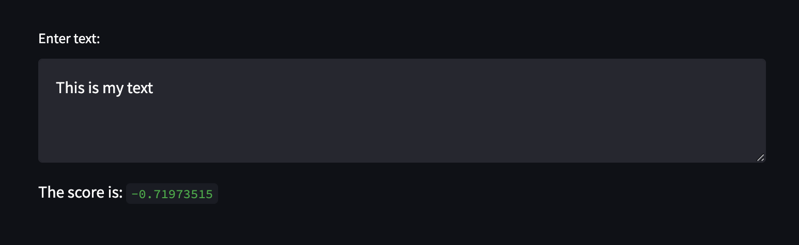

# projector-test-task
Тестове завдання для вступу на курс Machine Learning in Production.

## Installation
Create a virtual environment on you PC and then run:
```sh
pip install -r requirements.txt
```

## Running
To run the app use the next command:
```sh
streamlit run app.py 
```
Input you text in this field and then you will have a score.

